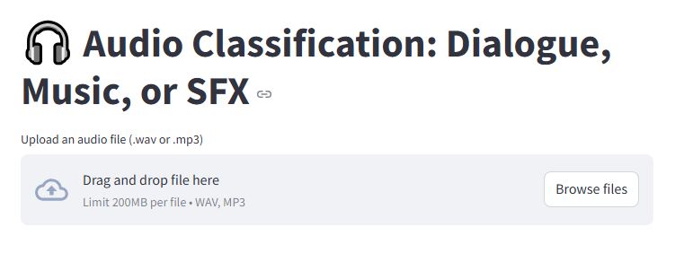

# 🎵 Audio Classification App

This project is a web-based application that classifies audio clips into one of 10 sound categories using a machine learning model trained on the UrbanSound8K dataset.

## 📦 Features

- Upload your own `.wav` file or use a built-in sample
- Real-time audio classification using a pre-trained model
- Interactive visualizations of the waveform and spectrogram
- Web-based UI powered by Streamlit

## 📁 Dataset

The model is trained on the [UrbanSound8K](https://urbansounddataset.weebly.com/urbansound8k.html) dataset. It consists of 8732 labeled sound excerpts (<=4s) of urban sounds from 10 classes:
- Air Conditioner
- Car Horn
- Children Playing
- Dog Bark
- Drilling
- Engine Idling
- Gun Shot
- Jackhammer
- Siren
- Street Music

## 🤖 Model Training

The audio classifier uses:
- **Librosa** for audio feature extraction
- **Scikit-learn** for model training (Random Forest Classifier)
- **Pickle** to save the trained model

Features extracted include:
- MFCC (Mel Frequency Cepstral Coefficients)
- Chroma Frequencies
- Mel Spectrogram
- Spectral Contrast
- Tonnetz

## 🌐 Live Demo

Try it out here 👉 [Live App](https://audio-classification-app-hxmtmr7u4n4qpuaf974x2l.streamlit.app/)

## Demo

### App in Action (GIF)


### Screenshot


## 🛠️ Installation

```bash
# Clone the repo
git clone https://github.com/GilStark85/audio-classification-app.git
cd audio-classification-app

# (Optional) Create and activate a virtual environment
python -m venv venv
source venv/bin/activate  # or venv\Scripts\activate on Windows

# Install dependencies
pip install -r requirements.txt

# Run the app
streamlit run app.py
```

## 🧪 Run Tests

```bash
python test_app.py
```

## 📁 Project Structure

```
audio-classification-app/
│
├── app.py                  # Streamlit frontend
├── train_audio_classifier.py  # Model training script
├── audio_model.pkl         # Trained model
├── test_app.py             # Unit tests
├── requirements.txt        # Dependencies
├── .gitignore
├── README.md
└── demo/
    ├── app-demo.gif
    └── app-screenshot.png
```

## 📝 License

This project is licensed under the [MIT License](LICENSE).

---

Created with ❤️ by [@GilStark85](https://github.com/GilStark85)
